<div align="center">

**🇬🇧 [English](README.md) · 🇷🇺 [Русский](README.ru.md) · 🇺🇿 [Oʻzbekcha](README.uz.md)**

</div>

# AI Ops Agent Design
[](https://github.com/uMax-Cyber/AgentBlueprint/actions/workflows/ci.yml)



Design patterns for running a weak LLM (Nemotron-120B) as a reliable infrastructure agent. Covers anti-hallucination training, tool-use discipline, memory systems, and team delegation — all validated with a 36-test suite on production infrastructure.

## The Challenge

Weak models hallucinate parameters, mix data from different contexts, don't stop when they have enough data, and can't distinguish tool errors from data. This project documents how to train and structure an agent to be reliable despite these limitations.

## Core Components

### 1. Thinking Discipline (SOUL.md)
```
1. Re-read the question — name the exact target
2. Verify, don't imagine — every fact from tool results
3. Get missing data — don't answer with holes
4. Check draft against question before sending
5. Finish the job — verify, then report
6. STOP when data is sufficient — don't over-explore
7. Use tool_search for discovery — never guess tool names
8. Infrastructure discipline — read first, confirm before change
```

### 2. Anti-Hallucination Rules (9 rules)
See [docs/anti-hallucination.md](docs/anti-hallucination.md) for the full set with examples.

### 3. Dual-Fallback Memory
```
LightRAG (semantic search) ← PRIMARY
        ↓ if unavailable
File vault (markdown + grep) ← FALLBACK
```
Single interface script handles both; always writes to both stores.

### 4. Team Delegation (Kanban)
```
Orchestrator agent → creates task cards → dispatches to workers
Worker (sysadmin profile) → picks up card → executes → reports
```
Up to 9 concurrent workers. Restart-safe with self-healing claims.

## Training Methodology

1. **Baseline test** — 36 tests across 3 domains (sysadmin, network, devops)
2. **Root-cause analysis** — classify each failure (instruction gap vs model limit)
3. **Targeted fix** — add rules to system prompt or skill files
4. **Re-test** — same 36 tests, measure improvement
5. **Iterate** — until 100% pass rate

## Results

| Metric | Before Training | After Training |
|--------|----------------|----------------|
| Overall pass rate | 67% (initial) | 100% (36/36) |
| Hallucination rate | ~30% of answers | 0% |
| Destructive action attempts | 2/36 tests | 0/36 tests |
| Average tool calls per task | 15+ (wandering) | 3-5 (focused) |
| Timeouts from over-exploration | 3/36 | 0/36 |

## Skills Architecture

Each skill is a markdown file with:
- YAML frontmatter (name, version, description)
- When to use (triggers)
- Step-by-step procedure
- Safety rules
- Real examples from production

See `skills/` directory for examples:
- `tool-discipline.md` — 9 anti-hallucination rules
- `tool-use-patterns.md` — 11 call patterns with good/bad examples
- `wifi-diagnosis.md` — step-by-step diagnostic runbook

## License
MIT

## 📬 Contact

Questions? Reach out: **[allumaxmail@gmail.com](mailto:allumaxmail@gmail.com)**

---

<div align="center">

**🇬🇧 [English](README.md) · 🇷🇺 [Русский](README.ru.md) · 🇺🇿 [Oʻzbekcha](README.uz.md)**

</div>
